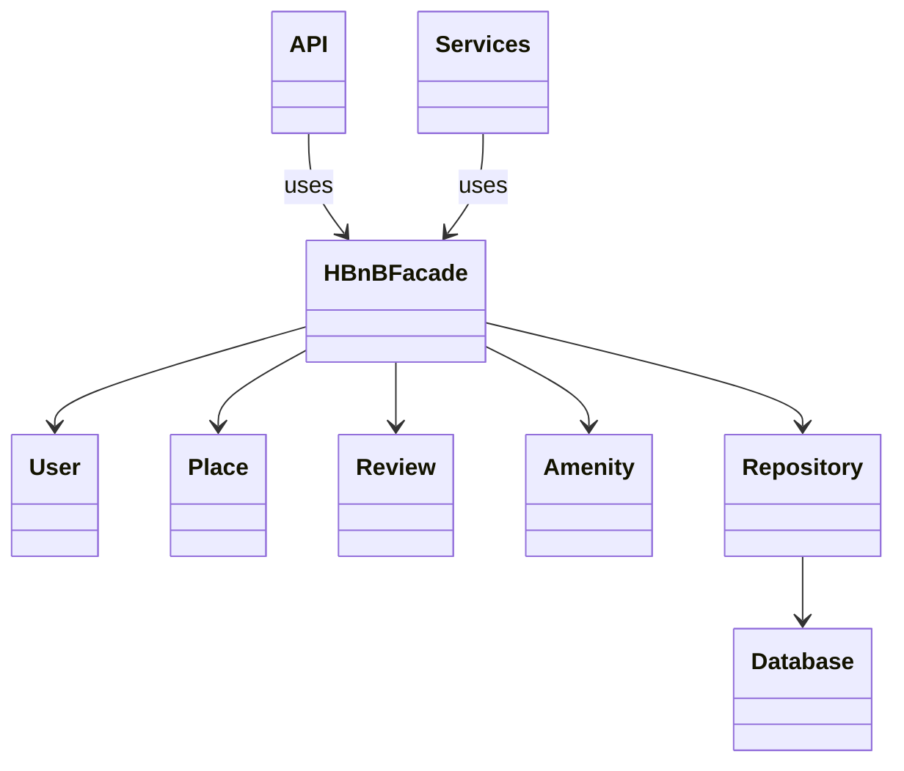
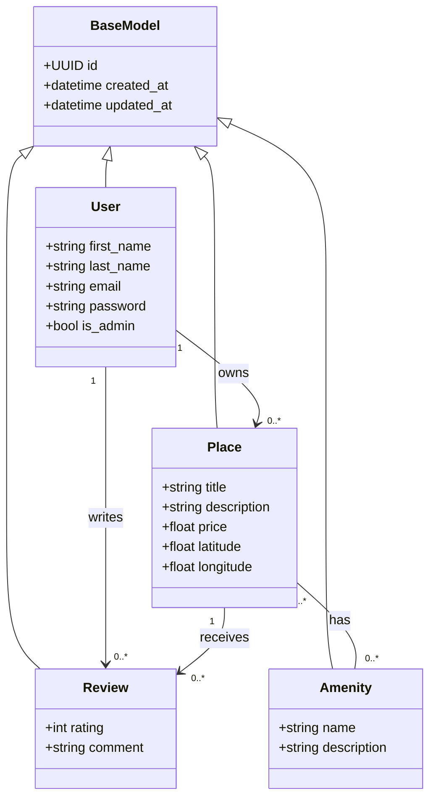
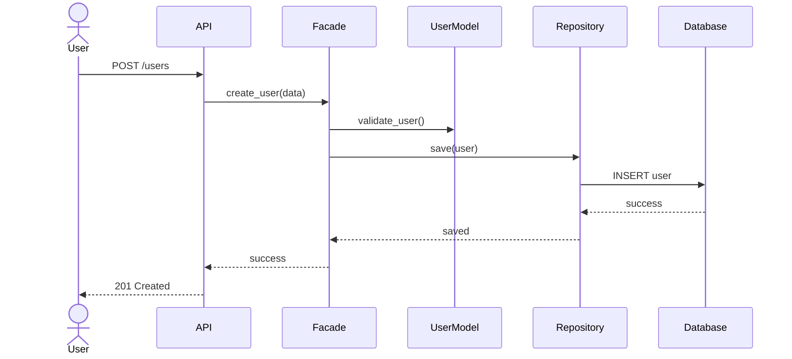
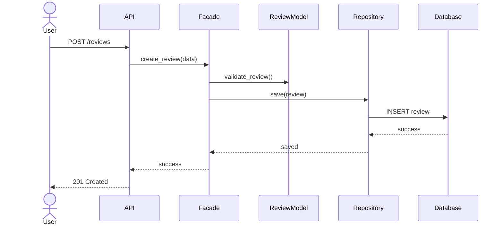
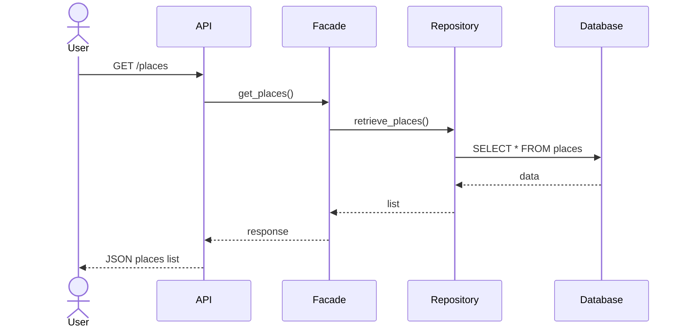

New README.md file

# HBnB Evolution - Technical Documentation

---

# 1. Introduction

This document presents the complete technical design for the HBnB Evolution application.

It serves as a blueprint for implementation and includes:

* High-Level Architecture (Package Diagram)
* Business Logic Layer Design (Class Diagram)
* API Interaction Flows (Sequence Diagrams)

The system follows a **three-layer architecture** and uses the **Facade Pattern** to simplify communication between layers.

---

# 2. High-Level Architecture

## 2.1 Overview

The system is divided into three main layers:

* Presentation Layer (API / Services)
* Business Logic Layer (Models)
* Persistence Layer (Database / Repository)

The **Facade Pattern (HBnBFacade)** acts as the central communication interface between layers.

---

## 2.2 Package Diagram

## 2.3 Explanation

* **Presentation Layer** handles user requests (API endpoints).
* **Business Layer** contains core entities and logic.
* **Persistence Layer** manages database operations.
* **Facade Pattern** ensures API does not directly access models or database.

---

# 3. Business Logic Layer

## 3.1 Overview

The Business Logic Layer contains all core entities:

* User
* Place
* Review
* Amenity

All entities inherit from `BaseModel`.

---

## 3.2 Class Diagram

---

## 3.3 Explanation of Entities

### BaseModel

Provides:

* Unique ID (UUID4)
* Creation timestamp
* Update timestamp

---

### User

Represents a system user who can:

* Create places
* Write reviews

---

### Place

Represents a property listing.

---

### Review

Represents feedback on a place.

---

### Amenity

Represents features available in a place.

---

## 3.4 Relationships

* A user owns many places
* A user writes many reviews
* A place receives many reviews
* A place has many amenities (many-to-many)

---

# 4. API Interaction Flow

## 4.1 User Registration

---

## 4.2 Place Creation

---

## 4.3 Review Submission

---

## 4.4 Fetching Places

---

## 4.5 Explanation

Each API call follows the same structure:

1. Client sends request to API
2. API forwards request to Facade
3. Facade handles business logic
4. Repository interacts with database
5. Response flows back to user

---

# 5. Design Decisions

## 5.1 Layered Architecture

Ensures separation of concerns:

* API (presentation)
* Business logic
* Persistence

## 5.2 Facade Pattern

Centralizes communication and simplifies API logic.

## 5.3 Inheritance

All entities inherit from BaseModel to avoid duplication.

---

# 6. Conclusion

This document defines the complete architecture of HBnB Evolution.

It serves as the foundation for implementation and ensures:

* Scalability
* Maintainability
* Clean architecture design

