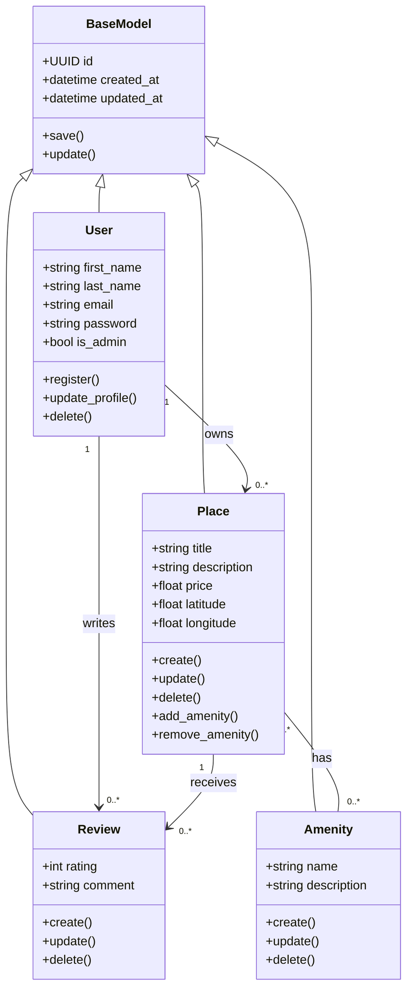

# HBnB - Business Logic Layer Class Diagram

## Objective

This diagram models the Business Logic Layer of the HBnB application. It focuses on the main entities (User, Place, Review, Amenity), their attributes, methods, and relationships.

----------------------------------------------------------------------------------------------------------------

# Class Diagram (UML - Mermaid)



----------------------------------------------------------------------------------------------------------------

# ENTITY EXPLANATIONS

## BaseModel

The BaseModel is the parent class for all entities.

### Responsibilities:

* Provide unique identifier (UUID4)
* Track creation date
* Track last update date

----------------------------------------------------------------------------------------------------------------

## User

Represents a system user.

### Key Attributes:

* first_name
* last_name
* email
* password
* is_admin

### Responsibilities:

* User registration
* Profile management
* Account deletion

----------------------------------------------------------------------------------------------------------------

## Place

Represents a property listing created by a user.

### Key Attributes:

* title
* description
* price
* latitude
* longitude

### Responsibilities:

* Create listings
* Update listings
* Delete listings
* Manage amenities

----------------------------------------------------------------------------------------------------------------

## Review

Represents feedback left by a user on a place.

### Key Attributes:

* rating
* comment

### Responsibilities:

* Create review
* Update review
* Delete review

----------------------------------------------------------------------------------------------------------------

## Amenity

Represents features available in a place.

### Key Attributes:

* name
* description

### Responsibilities:

* Create amenity
* Update amenity
* Delete amenity

----------------------------------------------------------------------------------------------------------------

# RELATIONSHIPS EXPLAINED

## User → Place

A single user can own multiple places.

## User → Review

A single user can write multiple reviews.

## Place → Review

A place can receive multiple reviews.

## Place ↔ Amenity

A many-to-many relationship:

* A place can have multiple amenities
* An amenity can belong to multiple places

----------------------------------------------------------------------------------------------------------------

# DESIGN NOTES

* All entities inherit from BaseModel to ensure consistency.
* Relationships follow real-world Airbnb logic.
* Multiplicity ensures scalability (1 user → many places/reviews).

```
```
