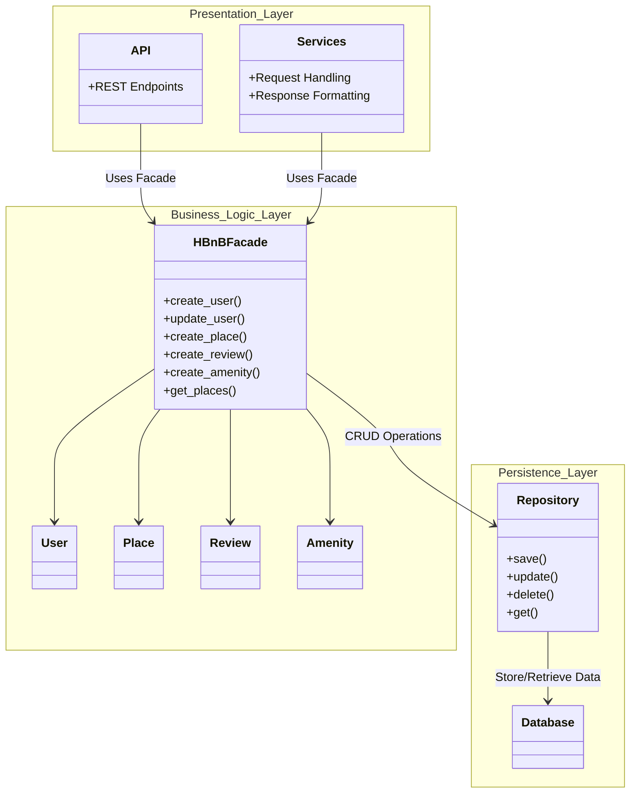

# High-Level Package Diagram

## Objective

This package diagram illustrates the high-level architecture of the HBnB application. The application follows a three-layer architecture consisting of the Presentation Layer, Business Logic Layer, and Persistence Layer. Communication between the layers is managed through the Facade Pattern.

---

## Package Diagram



---

## Layer Responsibilities

### Presentation Layer

The Presentation Layer is responsible for handling all interactions between the client and the application.

Components:

* API Endpoints
* Services

Responsibilities:

* Receive requests from users
* Validate incoming data
* Return responses
* Communicate with the Business Logic Layer

---

### Business Logic Layer

The Business Logic Layer contains the application's core business rules and domain models.

Components:

* HBnBFacade
* User
* Place
* Review
* Amenity

Responsibilities:

* Apply business rules
* Validate application data
* Coordinate operations between models
* Communicate with the Persistence Layer

---

### Persistence Layer

The Persistence Layer manages data storage and retrieval.

Components:

* Repository
* Database

Responsibilities:

* Save data
* Retrieve data
* Update records
* Delete records

---

## Facade Pattern

The HBnBFacade acts as a unified interface between the Presentation Layer and the Business Logic Layer.

Instead of the API communicating directly with the entities, all requests pass through the facade.

Benefits:

* Reduces coupling between layers
* Simplifies API implementation
* Centralizes business operations
* Improves maintainability
* Makes future extensions easier

---

## Communication Flow

1. A client sends a request to the API.
2. The API forwards the request to the HBnBFacade.
3. The facade executes the required business logic using the appropriate models.
4. The facade interacts with the repository for data persistence.
5. The repository stores or retrieves information from the database.
6. Results are returned through the facade to the API.
7. The API returns the final response to the client.

```
```
